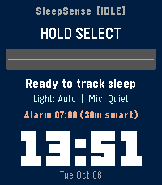
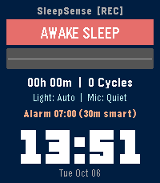
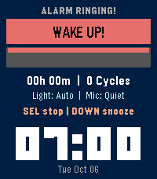
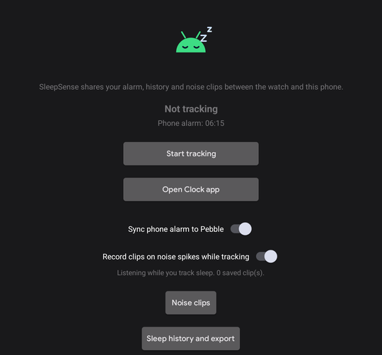
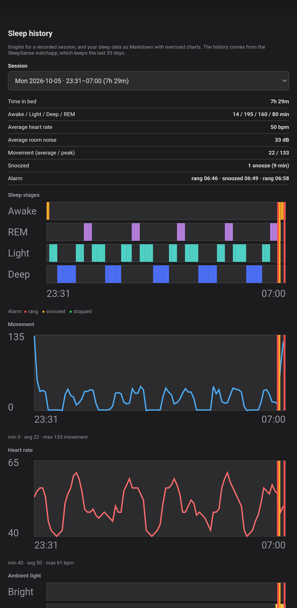
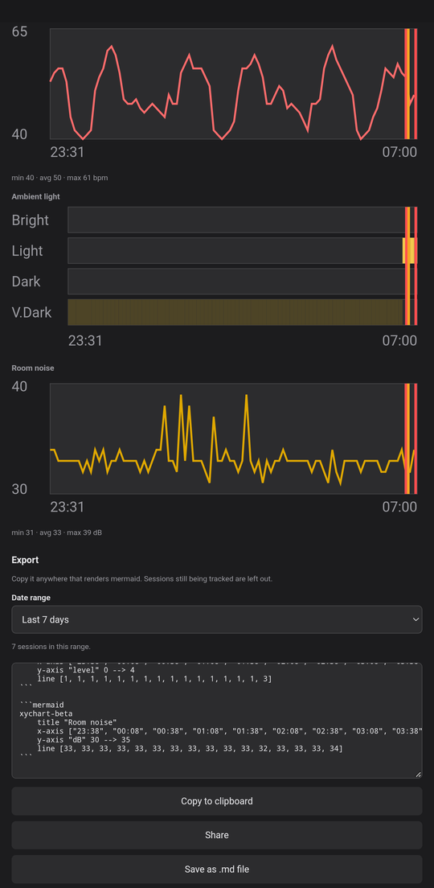
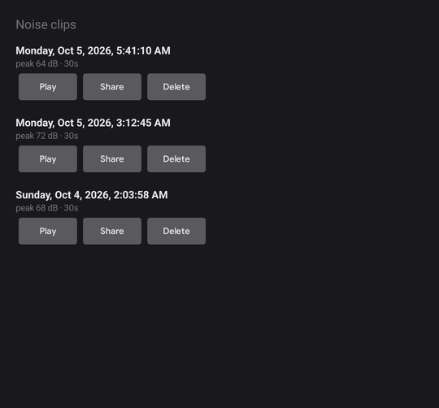
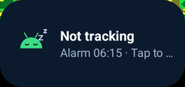
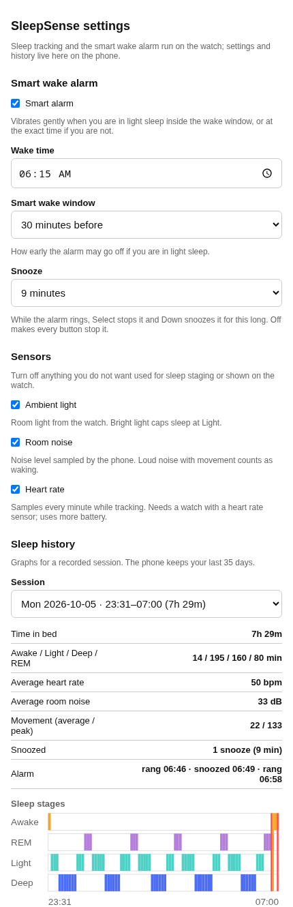

# SleepSense: Pebble Sleep Cycle Tracker

**SleepSense** is a sleep tracker and smart wake alarm for Pebble smartwatches (`aplite`, `basalt`, `chalk`, `diorite`, `emery`, `flint`, `gabbro`), with an optional **Android companion app** that adds a home-screen widget, real room-noise tracking with spike clips, sleep-history graphs and Markdown export.

It combines the watch's **accelerometer** (movement), **ambient light sensor**, **heart rate** and the **phone's microphone** to classify sleep into **Awake**, **Light (N1/N2)**, **Deep (N3/Slow-Wave)** and **REM** across ~90-minute cycles.

The watch app works on its own. Everything marked *(Android app)* needs the companion app, and the Pebble/Core Devices app on the phone.

---

## Screenshots

**Watch** (Pebble Time 2): idle, tracking, and the alarm ringing.

<table>
  <tr>
    <td align="center"><br><sub>Idle</sub></td>
    <td align="center"><br><sub>Tracking</sub></td>
    <td align="center"><br><sub>Alarm ringing</sub></td>
  </tr>
</table>

**Android app** (dark theme shown; it follows the system theme): the main screen, the sleep history for a night, and the export.

<table>
  <tr>
    <td align="center" valign="top"><br><sub>Main screen</sub></td>
    <td align="center" valign="top"><br><sub>Sleep history</sub></td>
    <td align="center" valign="top"><br><sub>Export</sub></td>
  </tr>
</table>

**Noise clips, the home-screen widget, and the watch app's settings page:**

<table>
  <tr>
    <td align="center" valign="top"><br><sub>Noise clips</sub></td>
    <td align="center" valign="top"><br><sub>Widget</sub></td>
    <td align="center" valign="top"><br><sub>Settings page</sub></td>
  </tr>
</table>

The sleep data in these screenshots is sample data, not a real night.

---

## Watch app

### Features

- **Sleep staging** from several sensors:
  - **Movement**: per-minute activity counts from Pebble Health (`health_service_get_minute_history`), with a raw `accel_data_service` fallback where Health history is unavailable.
  - **Ambient light**: minute-level room light (`VeryDark` … `VeryLight`) to catch lights on, sleep onset and waking.
  - **Heart rate**: sampled every minute while tracking (watches with a sensor only).
  - **Room noise** *(Android app)*: measured by the phone's microphone. Without the companion app no noise level is sent.
- **Smart wake alarm**: a target time plus a wake window (15 / 30 / 45 minutes). It vibrates gently once you are in light sleep inside the window, and at the exact time otherwise. **Snooze** (off, 5, 9, 10 or 15 minutes) is set in Settings.
- **On-wrist hypnogram**: colour-coded timeline of the last 2 hours, with sleep time, cycles, sleep score, light, noise and heart rate.
- **Date and time** under the alarm row on the Pebble Time 2 (`emery`), in the largest digits that fit.
- **Keeps recording**: while tracking, the watch schedules a wakeup so the app relaunches if the watch drops back to the watch face, and fills the gap from Pebble Health history.
- **Per-sensor switches**: light, noise and heart rate can each be turned off in Settings.
- **Voice dream journal** on watches with a microphone (`basalt`, `chalk`, `diorite`, `emery`): dictate a note in the morning.

### Watch controls

Changes need a deliberate **hold** (about a second; the watch buzzes once to confirm), so a stray press while you sleep does nothing. A ringing alarm is the exception: any press stops it, and Down snoozes it.

| Button | Hold | Press / double-press | While the alarm rings |
| :--- | :--- | :--- | :--- |
| **SELECT** | Start / stop sleep tracking | Double-press: voice dream journal | Press: stop the alarm |
| **UP** | Turn the smart alarm on / off | Nothing | Press: stop the alarm |
| **DOWN** | Cycle the smart wake window (15 → 30 → 45 min) | Nothing | Press: snooze (when enabled) |

### Settings and history (phone)

Open the app's settings in the Pebble app. The page has:

- **Smart wake alarm**: on/off, wake time, wake window, snooze length.
- **Sensors**: light, room noise, heart rate.
- **Sleep history**: pick a session to see its stats and graphs: sleep stages (with the alarm ringing, snoozed and stopped marked), movement, heart rate, ambient light and room noise. The phone keeps the last 35 days.
- **Export**: your sleep data as Markdown with mermaid charts, for the last 7, 14 or 30 days or since the last export. Copy it to the clipboard or download it.

---

## Android app (SleepSense Health Bridge)

The `android/` folder is a small companion app. The Pebble app will not let an Android app message the watch directly, so the watchapp's own phone-side code (PebbleKit JS) does the talking to the watch. It reaches the Android app through a **local bridge**: a foreground service listening on `127.0.0.1:8765` (loopback only, so nothing off the phone can connect).

### Main screen

Laid out like the other Pebble companion apps: logo, status, buttons, then settings.

- **Status**: "Tracking sleep since 23:10", "Not tracking" or "Watch app closed", plus your next phone alarm.
- **Start / Stop tracking**: starts tracking on the watch (opening SleepSense on the watch first if needed), or stops it. Stopping works only while SleepSense is open on the watch.
- **Open Clock app**: opens the Clock app's alarm list.
- **Sync phone alarm to Pebble**: see below.
- **Record clips on noise spikes while tracking**: see below (off until you turn it on).
- **Noise clips**, **Sleep history and export**, **Health Connect** access, **Add widget to home screen**.

### Features

- **Alarm sync (phone to watch)**: the watch wake time follows your phone's **next alarm**. Change it in the Clock app and the watch follows within a minute. If the phone has no alarm, the watch smart alarm is turned off too. The app only *reads* your alarms; it never changes them. A change you make on the watch (for example turning the alarm off) stays until the phone alarm changes again.
- **Home-screen widget**: logo, tracking status and next alarm. Tap it to start tracking on the watch; while already tracking, a tap just opens the app, so a stray tap can't touch a running night. The status comes from the watch's once-a-minute check-in, so it can lag a little.
- **Noise tracking and clips** (opt-in, uses the microphone): while the watch is tracking, the phone listens and keeps a running average of the room level (this is also the noise reading shown on the watch). If the level stays at least **15 dB above that average and above 45 dB** for 2 seconds, it saves a **30-second WAV clip** (5 seconds before the spike, 25 after), at most one every 30 seconds, keeping the 30 newest. The **Noise clips** screen lists them by capture date and time, with peak level, and lets you play, share or delete each one. Levels are approximate dB: phone microphones are not calibrated. Place the phone near the bed.
- **Sleep history and export**: the same graphs, stats and export as the settings page (they share one piece of code, `src/pkjs/lib/report-core.js`). Export has **Copy**, **Share** (Android share sheet, as text) and **Save as .md file**. The history is sent from the watchapp's code whenever SleepSense is open on the watch, so open it after a night to refresh the screen.
- **Health Connect** *(experimental)*: writes finished sleep sessions (with stages) and heart rate to Health Connect when you stop tracking. It depends on the Pebble app delivering watch messages straight to this app, which has not been confirmed to work; use the history export if you need your data out.
- Follows the system **dark / light** theme.

### Permissions

| Permission | Why |
| :--- | :--- |
| Microphone | Noise tracking and clips (asked when you switch it on) |
| Foreground service (special use, microphone) | The bridge runs all the time; the microphone type is added only while listening |
| Notifications | The bridge's quiet foreground notification |
| Internet | Only for the local socket on `127.0.0.1` |
| Receive boot completed | Restart the bridge after a reboot or an app update |
| Health Connect (write sleep, write heart rate) | The experimental Health Connect export |

### Local bridge (for the curious)

| Request | What it does |
| :--- | :--- |
| `GET /alarm[?tracking=0\|1&since=ms]` | Next phone alarm and a change counter; the optional query is the watch's check-in with its tracking state |
| `GET /command` | Held open up to 25 s; returns `start`, `stop` or `none` for a button/widget request |
| `POST /sessions` | The watchapp's sleep history (JSON) |
| `GET /noise`, `/noise/start`, `/noise/stop` | Noise level, and start/stop listening |

### Build and install the Android app

Needs JDK 21 and the Android SDK (min SDK 28). From the repository root:

```sh
cd android
./gradlew assembleDebug
adb install -r app/build/outputs/apk/debug/app-debug.apk
```

Open the app once so it can start the bridge (it restarts itself after updates and reboots). The history screen bundles `src/pkjs/lib/report-core.js` through a symbolic link in `android/app/src/main/assets/`.

---

## Project structure

```
PebbleSleepTracker/
├── package.json                   # App UUID, capabilities, message keys, menu icon
├── wscript                        # Pebble build configuration
├── resources/images/icon.png      # Watch app menu icon
├── docs/screenshots/              # Images used in this README
├── src/
│   ├── c/                         # Watch app
│   │   ├── pebble_sleep_tracker.c # Entry point and wiring
│   │   ├── model/sleep_types.h    # SleepStage, SleepEpoch, SleepSession, alarm and sensor settings
│   │   ├── engine/                # Sleep staging, tracking session, smart alarm and snooze
│   │   ├── comm/                  # AppMessage with the phone, dictation
│   │   └── ui/                    # Dashboard, hypnogram, clock, hold-to-change buttons
│   └── pkjs/                      # Phone-side JavaScript (runs in the Pebble app)
│       ├── index.js               # Messages with the watch, history, settings, bridge calls
│       └── lib/
│           ├── config-page.js     # Settings page (alarm, sensors, history, export)
│           ├── history.js         # 35 days of per-minute history, bucketed for graphs
│           ├── report-core.js     # Graphs and Markdown export (shared with the Android app)
│           ├── phone-alarm.js     # Asks the Android app for the next alarm and commands
│           ├── session-push.js    # Sends the history to the Android app
│           └── noise-bridge.js    # Starts/stops phone noise monitoring
└── android/                       # Companion app (Kotlin)
    └── app/src/main/
        ├── java/net/webstas/sleepsense/
        │   ├── MainActivity.kt, ClipsActivity.kt, HistoryActivity.kt
        │   ├── AlarmBridgeService.kt   # The local bridge (foreground service)
        │   ├── PhoneAlarmSync.kt, WidgetState.kt, TrackingControl.kt, SleepWidgetProvider.kt
        │   ├── NoiseMonitor.kt         # Microphone level, spike detection, clips
        │   ├── SessionStore.kt, SleepSession.kt, SleepListenerService.kt   # History and Health Connect
        │   └── BootReceiver.kt
        ├── assets/                     # history.html and a link to report-core.js
        └── res/                        # Layout, themes, icon, widget
```

---

## Build and install the watch app

```sh
pebble build
```

Emulators:

```sh
pebble install --emulator basalt    # Pebble Time (colour)
pebble install --emulator chalk     # Pebble Time Round
pebble install --emulator diorite   # Pebble 2 HR (monochrome, heart rate, microphone)
pebble install --emulator emery     # Pebble Time 2
```

A physical watch, through the Pebble app's Developer Connection:

```sh
pebble install --phone <PHONE_IP_ADDRESS>
```

If the phone is plugged in by USB but not reachable over Wi-Fi, tunnel the connection through adb:

```sh
adb forward tcp:9000 tcp:9000
pebble install --phone 127.0.0.1
adb forward --remove tcp:9000
```

---

## Known limits

- **Noise** is real only with the Android app; the dB values are approximate.
- **Start/stop from the phone** (button and widget) needs the Pebble app connected; stop needs SleepSense open on the watch.
- **History** reaches the Android app only while SleepSense is open on the watch.
- **The alarm sync is one-way** (phone to watch) on purpose: Android has no safe way to switch a Clock-app alarm back on, and turning one off disables the whole repeating alarm.
- **Health Connect** export is experimental (see above).
